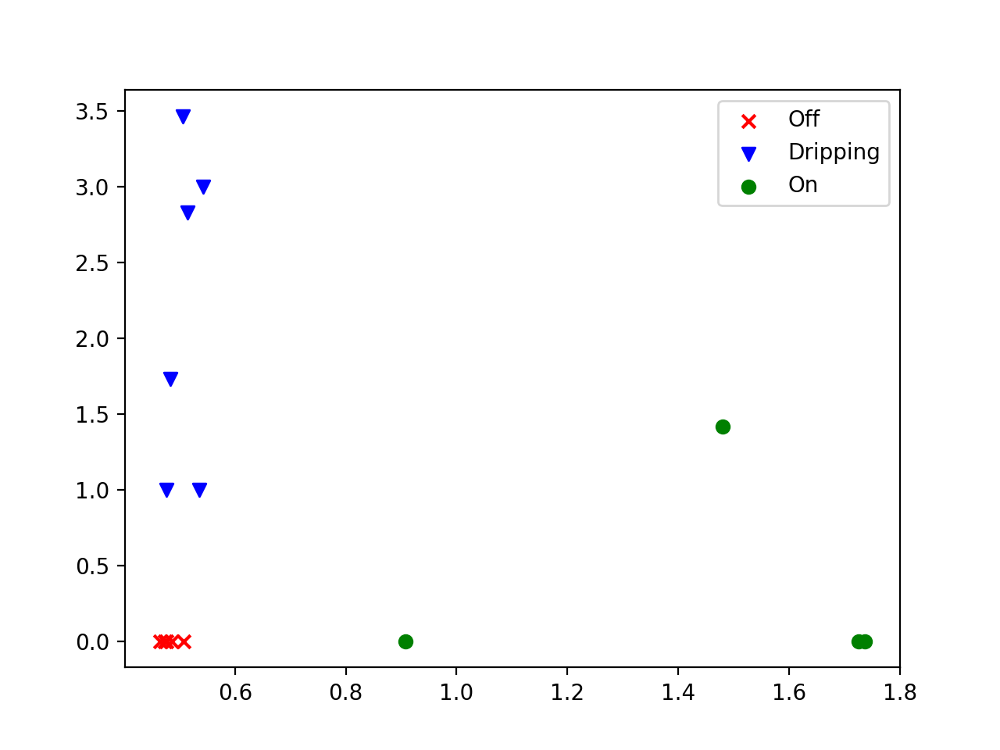

# SVM Audio Classification

AOA Final Project, using an SVM (Support Vector Machine) to classify audio from a kitchen sink.

## Project structure

- There are configurations for everything you need to run in Pycharm.
- There is a `requirements.txt` that has all of the pip packages you need.
- Use `pip install -r requirements.txt` from a terminal in your virtual environment.
- Lastly, this depends on `Python 3.9` for type annotations!

### Part 1: Getting the data

The goal is to classify audio data from a kitchen sink.
We will try to classify data into three categories:

1. Off - the sink is completely off, only ambient noise
2. Drip - the sink is turned such that there is a slight but consistent drip
3. Full - the sink is turned on fully

First, we'll write a little script that helps us get this data/

#### `record_sample.py`

This is a script that walks you through recording a sample of `wav` files and a `csv` file for the data you need.
It uses your computer's built in microphone default to record, my Mac's was good enough to provide good results.
The prompt is as follows:


```
Enter sample length (seconds): 1
Make sure it's quiet, then press enter to record for 1 seconds...

Recording...

Set the faucet to drip, then press enter to record for 1 seconds...

Recording...

Turn the faucet on, then press enter to record for 1 seconds...

Recording...

Do you want to save this (1 = yes, other = no): 1

Data has been saved!
```

Warnings:
- You may need to change the number of channels you have for recording

#### `plot_audio_real_time.py`

This was a file that I borrowed from the `sounddevice` Python libraries docs.
It helped me debug any audio issues I was having and got me familiar with the library.
It should run just fine with it's configuration, fun to try out honestly!

### Part 2: Cleaning/Preparing the data

Now that we have our samples and our file of raw input, we need to generate some useful information from it.
I hope to do this using the [Librosa Package](https://librosa.org/doc/latest/index.html).

#### In Search of Features

This is a Jupyter notebook that documented my (very) creative process of feature selection for the audio samples I made.
It can be run the following way if you already have a virtual environment with the requirements installed:
- `jupyter-notebook`
- navigate to where the `.ipynb` file is and open it
- press `Run All`

#### `features.py`

This uses the findings from `In Search of Features` to build out a csv that will be useful for training our data.
It finds the amplitudes and peak count for each of our samples and then stores them in a dataframe.
It also plots the results, colored by state type (off, drip, on) on a scatter plot.
The first thing I noticed is that I need more data!


## Part 3: Classifying with the SVM

Lastly, we need to classify our faucet data. 

### The SVM

The SVM has a couple parts that make it work. In the end, it’s really just a linear combination of weights, one per feature, and an intercept with a penalty function that penalizes it when misclassifies a data point. You run it against a training data set to determine ‘appropriate’ weights and then, you can enter in values and predict what class they might be in.

``` python
    def __init__(self, epochs, rate=0.0001):
        self.epochs = epochs
        self.rate = rate
        self.current_epoch = 1

        self.w1 = np.float64(0)
        self.w2 = np.float64(0)
        self.b = np.float64(0)
```

It runs for a certain number of times, known as epochs, and attempts to generate an optimal hyperplane (one that maximizes the margins between the support vectors, or those points closest to the ‘edge’ of the classification), by generating a predicted set of values from a linear combination of it’s weights and intercept and using a loss function to update the weights/intercept based on the error of that predicted set.

```python
    def fit(self, data, classes):
        for epoch in range(self.current_epoch, self.epochs):
            self.current_epoch = epoch
            y_pred = (self.w1 * data[:, 0] + self.w2 * data[:, 1] + self.b) * classes
```

The loss function I used was the Hinge Loss function, which is intended to be used as a ‘maximum-margin’ loss function. When the value predicted is correctly classified, the weights are only updated with the regularization parameter scaled by the learning rate. However, if the value is misclassified, the loss function uses gradient descent to optimize the classification and update the weights using the class value, data values, as well as the learning rate and regularization parameter.

```python
            for index, value in enumerate(y_pred):
                if value < 1:
                    m1_deriv += data[index, 0] * classes[index]
                    m2_deriv += data[index, 1] * classes[index]
                    b_deriv += classes[index]

            self.w1 += self.rate * (m1_deriv - 2 * self.regularization() * self.w1)
            self.w2 += self.rate * (m2_deriv - 2 * self.regularization() * self.w2)
            self.b += self.rate * (b_deriv - 2 * self.regularization() * self.b)
```

The regularization parameter prevents the model from overfitting by slowing the magnitude of change allowed the longer the model has been training.

```python
    def regularization(self) -> float:
        return 1 / self.current_epoch
```

### Run Time

This paper discusses SVM run time and comes up with a general O(n^2) (https://www.csie.ntu.edu.tw/~cjlin/papers/libsvm.pdf). However, I believe my implementation runs in O(epochs * len(dataset)) since my SVM model has a for loop that iterates for epoch number of times and, for each epoch,  adjusts the weights for each value in the provided training dataset. 

### Fitting the Data

An example of how to fit the data to detect water being on and dripping can be found in `water_classification.py`.

I got the chance to revise my data collection script to also process features and put that into a csv file.
This greatly streamlined the data collection process and I collected a much bigger dataset that also separated well.
I used this as my training data for the web server.



I used this as my training data for the models.
I did a test/train split with 80% train, and regularly get the accuracy of 1.0 for both models, even though the dataset is so small.


## Part 4: The Web Server

The final portion of the project is the webserver. This is just a quick and dirty FastAPI server that exposes 2 endpoints, a ‘/root’ endpoint which doesn’t do anything particularly interesting, and a ‘/status’ endpoint, that uses the system default mic and the trained SVM drip/on models from the training datasets I’ve already generated to give a classification for current conditions. 
When you hit the ‘/status’ endpoint, it’s a GET request, it will record audio data from the mic for a predetermined amount of time (4 seconds at the moment), and then will run the two models to detect if the just recorded data has classified to be dripping or on. It will then return a simple JSON blob with the current water state.

It is self-documented using OpenAPI docs. If you want to mess around with it, use the “run_fastapi” Pycharm configuration and navigate to http://127.0.0.1:8000/docs#/default/get_water_status_status_get.  